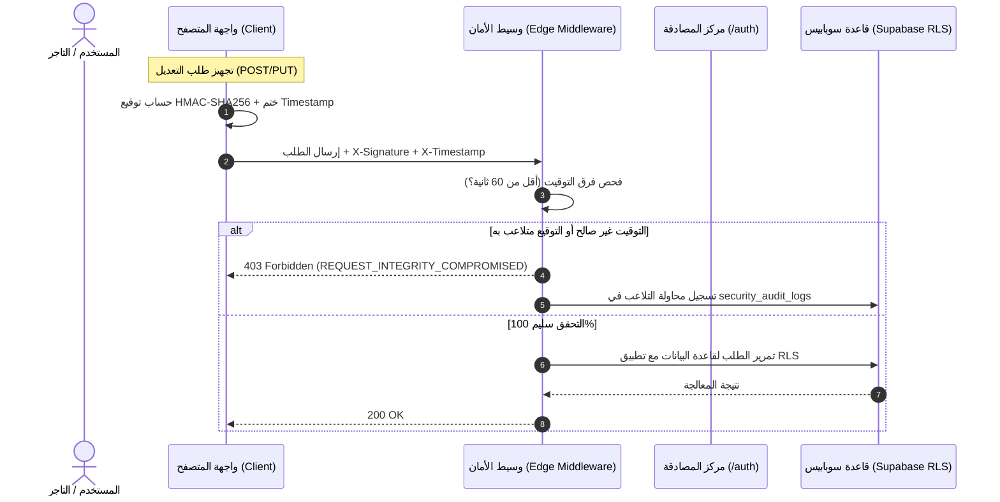

# معمارية وطوبولوجيا المنظومة (System Architecture & Topology)
## منظومة eShamikh Cloud & Services Ecosystem

---

## 1. الطوبولوجيا السحابية وتوزيع النطاقات (Domain Topology)

تعتمد المنظومة على نطاق رئيسي موحد يتبع لـ **eShamikh Studio** تتفرع منه البوابات والخدمات كالتالي:

```text
                                  *.eshamikh.com (Root Domain)
                                               │
             ┌─────────────────────────────────┼─────────────────────────────────┐
             │                                 │                                 │
  services.eshamikh.com               estore.eshamikh.com                 *.estore.eshamikh.com
  (Central Services Hub)             (Merchant Hub / Admin)               (Merchant Storefronts)
             │                                 │                                 │
     ┌───────┴───────┐                         └──────────────┬──────────────────┘
     │               │                                        │
  /services/      /auth                                 SSO Session Check
  ├── estore    (Central SSO)                  (Redirects if unauthorized to /auth)
  ├── etrack           ▲
  ├── eform            │ Shared Cookie (.eshamikh.com)
  └── elink    ────────┴───────────────────────────────────────────────────────
```

### جدول مسارات ونطاقات المنظومة

| النطاق / المسار | النطاق الفرعي | الوصف والوظيفة المعمارية |
| :--- | :--- | :--- |
| `https://services.eshamikh.com` | `services` | **البوابة المركزية:** نقطة الانطلاق وإدارة منظومة الأدوات السحابية للمستخدم. |
| `https://services.eshamikh.com/auth` | `services` (`/auth`) | **مركز المصادقة الموحد (SSO):** شاشات الدخول، التسجيل، وإدارة الملف الشخصي لكافة المنظومة. |
| `https://estore.eshamikh.com` | `estore` | **بوابة التجار الرئيسية:** لوحة التحكم في المتاجر، المنتجات، المبيعات، وفواتير العمولات. |
| `https://[store-slug].estore.eshamikh.com` | `*.estore` | **واجهات المتاجر المستقلة:** متجر العرض والشراء الخاص بكل تاجر مشترك. |
| `/services/etrack` | مسار موديولي | **محرك التتبع الذكي:** واجهة وتكامل تتبع الشحنات والطرود البريدية محلياً. |
| `/services/eform` | مسار موديولي | **أداة بناء النماذج الديناميكية:** لجمع البيانات واستمارات العملاء. |
| `/services/elink` | مسار موديولي | **أداة الروابط المصغرة والتوجيه:** إدارة وتحليل الروابط التسويقية. |

---

## 2. معمارية الـ Monorepo وتوزيع المجلدات

المشروع مصمم وفق هيكلية **Modular Monorepo** تجمع المنطق المشترك مع استقلالية الخدمات:

```text
Website/
├── .md/                             # مجلد التوثيق والسياق المرجعي (10 ملفات)
│   ├── instruction.md
│   ├── memory.md
│   ├── architecture.md
│   ├── possibleThreats.md
│   ├── security.md
│   ├── database.md
│   ├── designSystem.md
│   ├── businessLogic.md
│   ├── apiContract.md
│   └── roadmap.md
├── assets/                          # الأصول البصرية المشتركة والشعار
│   ├── logo.jpg / shamikh-logo.jpg
│   ├── logo.png / shamikh-logo.png
│   └── logo-white.png / shamikh-logo-white.png
├── packages/                        # الحزم البرمجية المشتركة (Shared Packages)
│   ├── ui/                          # مكونات التصميم الموحدة (Button, Card, Modal, Input)
│   ├── security-signer/             # مكتبة التوقيع التلقائي HMAC-SHA256
│   └── database-client/             # عميل Supabase المشترك وسياسات الاتصال
├── services/                        # مجلد الخدمات المستقلة (Modular Services)
│   ├── estore/                      # خدمة المتاجر المصغرة (Merchant Dashboard & Storefront)
│   │   ├── components/
│   │   ├── lib/billing.ts           # خوارزمية عمولة 2.5% وبروتوكول الحجب
│   │   └── pages / app
│   ├── etrack/                      # محرك التتبع الذكي
│   ├── eform/                       # نماذج واستطلاعات eShamikh
│   └── elink/                       # الروابط المختصرة
├── apps/                            # التطبيقات التشغيلية الرئيسية
│   └── hub/                         # بوابة services.eshamikh.com ومركز /auth
│       ├── middleware.ts            # وسيط فحص الـ HMAC وفحص الختم الزمني وتوجيه النطاقات
│       ├── app/
│       │   ├── page.tsx             # البوابة المركزية للخدمات
│       │   └── auth/                # مركز المصادقة الموحد
│       └── public/
└── supabase/                        # ملفات هجرة قواعد البيانات والإعدادات
    └── migrations/                  # ملفات SQL Migration وسياسات RLS
```

---

## 3. بروتوكول توجيه المصادقة الموحد (SSO Redirection Protocol)

### أ. قاعدة التوجيه الإلزامية للملف الشخصي
- إذا كان المستخدم يتصفح أي خدمة (مثل `https://estore.eshamikh.com/dashboard`) ونقر على **"إدارة الحساب"** أو **"الملف الشخصي"**، يُمنع بناء صفحة بروفايل محلية في المتجر.
- يتم تحويله فوراً عبر بروتوكول التوجيه المركزي إلى:
  ```text
  https://services.eshamikh.com/auth?redirect_to=https://estore.eshamikh.com/dashboard
  ```
- بعد تحديث البيانات أو إنهاء إدارة الحساب، يتم إعادة توجيهه تلقائياً إلى الرابط الأصلي (`ORIGIN_URL`) الموجود في المعامل `redirect_to`.

### ب. مشاركة الجلسات عبر الكوكيز المشتركة (Root-Domain Cookies)
- يتم تخزين كوكيز الجلسة الصادرة من Supabase أو خادم المصادقة عبر النطاق الأب:
  ```http
  Set-Cookie: eshamikh_session=<ENCRYPTED_JWT>; Domain=.eshamikh.com; Path=/; HttpOnly; Secure; SameSite=Lax; Max-Age=2592000
  ```
- بهذه الطريقة، عند تسجيل الدخول في `services.eshamikh.com/auth`، تصبح الجلسة صالحة تلقائياً في `estore.eshamikh.com` وأي نطاق فرعي تابع، دون الحاجة لإعادة طلب كلمة المرور.

---

## 4. مخطط تدفق البيانات والأمان (Architecture Flowchart)


