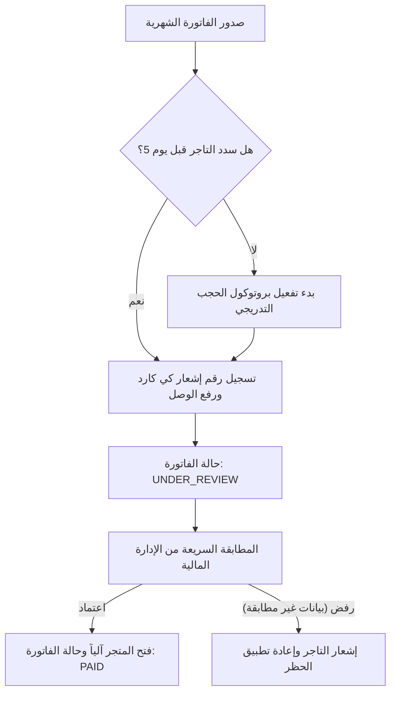

# منطق الأعمال والفوترة ونظام كي كارد (Business Logic & Billing System)
## منظومة eShamikh Cloud & Services Ecosystem

---

## 1. نموذج الاشتراك الشهري الثابت (Fixed Monthly Subscription)

### أ. الرسوم الشهرية الثابتة (25,000 د.ع.)
- تعتمد منصة **eShamikh Studio** نموذج الاشتراك الشهري الثابت للمتاجر الشريكة التابعة لـ `eStore` بواقع **25,000 دينار عراقي شهرياً** لكل متجر، بغض النظر عن حجم المبيعات أو عدد الطلبات.
- **مزايا هذا النموذج للتاجر:**
  - شفافية مالية مطلقة وثبات في التكاليف التشغيلية.
  - إعفاء أرباح المبيعات من أي استقطاع نسبي أو عمولات متغيرة.
- **آلية استحقاق الفاتورة:**
  - تُصدر الفاتورة الشهرية بقيمة ثابتة قدرها **25,000 د.ع.** فجر اليوم الأول من كل شهر ميلادي لكل متجر نشط في المنظومة.

---

## 2. دورة الفوترة الشهرية (Monthly Billing Cycle)

| الفترة الزمنية | الحدث البرمجي المنفذ | حالة الفاتورة |
| :--- | :--- | :---: |
| **طوال الشهر (يوم 1 إلى نهاية الشهر)** | تراكم مبيعات المتجر واحتساب العمولات لكل طلب مسلم | قيد التجميع |
| **فجر يوم 1 من الشهر الجديد (00:01 UTC)** | تشغيل وظيفة Cron Job آلية تجمع عمولات الشهر الماضي وتُصدر فاتورة رسمية | `PENDING` |
| **يوم 1 إلى يوم 5 (فترة السماح - 5 أيام)** | فترة سداد مرنة دون أي تأثير على عمل المتجر أو لوحة التحكم | `PENDING` (سماح) |
| **يوم 6 (الساعة 00:00)** | تطبيق **المستوى الأول من الحظر (Tier 1: Checkout Lock)** | `OVERDUE` (المستوى 1) |
| **يوم 8 (الساعة 00:00)** | تطبيق **المستوى الثاني من الحظر (Tier 2: Dashboard Lock)** | `OVERDUE` (المستوى 2) |
| **يوم 15 (الساعة 00:00)** | تطبيق **المستوى الثالث من الحظر (Tier 3: Full Suspension)** | `OVERDUE` (المستوى 3) |

---

## 3. بروتوكول الحجب والتعليق التدريجي (3-Tier Auto-Freeze Protocol)

```text
[يوم 1-5: فترة سماح كاملة] ──────> [يوم 6: قفل صفحة الشراء] ──────> [يوم 8: قفل لوحة التحكم] ──────> [يوم 15: إيقاف النطاق]
         (Active)                      (Tier 1 Lock)                  (Tier 2 Lock)                   (Suspension)
```

### المستوى الأول (Tier 1 - يوم 6): قفل الشراء (Checkout Lock)
- **الأثر على الزوار:** يتم تعطيل زر "إتمام الشراء" أو "إرسال الطلب" في واجهة متجر التاجر (`*.estore.eshamikh.com`).
- **الرسالة المعروضة للمشترين:**
  > *"المتجر يخضع حالياً لعملية صيانة دورية وتحديث للنظام، يُرجى المحاولة في وقت لاحق."*
- **الأثر على التاجر:** تظهر رسالة تحذيرية برتقالية عاجلة في لوحة التحكم توضح ضرورة سداد الفاتورة لفتح المتجر.

### المستوى الثاني (Tier 2 - يوم 8): قفل لوحة التحكم (Dashboard Lock)
- **الأثر على التاجر:** يتم حجب جميع أقسام لوحة التحكم (المنتجات، الإحصائيات، العملاء).
- **إعادة التوجيه الإلزامية:** أي رابط يفتحه التاجر داخل لوحته يتم تحويله قسراً إلى:
  `https://estore.eshamikh.com/dashboard/billing/pay`
- لا يمكن استعراض أي بيانات حتى يتم إدخال إشعار السداد.

### المستوى الثالث (Tier 3 - يوم 15): التعليق الشامل (Full Suspension)
- **الأثر على النطاق:** يتم تعليق النطاق الفرعي للمتجر كلياً وتوجيه الزوار إلى صفحة تعليق رسمية تابعة لـ `eShamikh Studio`.
- يتطلب إعادة التفعيل التواصل مع الإدارة الفنية بعد تسوية المبالغ المتراكمة.

---

## 4. مسار تسوية كي كارد العراقية (Qi Card Settlement Workflow)

نظراً لخصوصية السوق المالي العراقي، تتيح المنظومة مساراً سريعاً وسلساً لسداد الفواتير عبر محفظة كي كارد:



### حقول واجهة السداد:
1. **المبلغ المطلوب بدقة (بالدينار العراقي IQD):** يُعرض للمستخدم مع رقم حساب المنظومة في كي كارد.
2. **رقم إشعار المعاملة (Qi Card Transaction Reference):** حقل نصي إلزامي فريد لمنع التكرار.
3. **رفع صورة إيصال التحويل (Receipt Image Upload):** مستند إثبات العملية للمطابقة البنكية.
4. **تفعيل مؤقت مشروط:** بمجرد رفع الإيصال، يحصل المتجر على رفع مؤقت للحظر لمدة 24 ساعة لحين استكمال المطابقة اليدوية.
